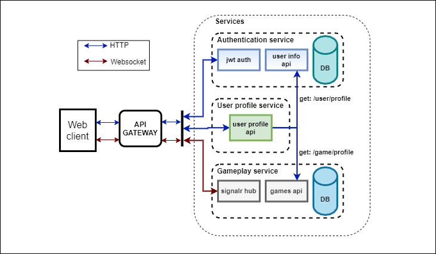

# RockPaperScissors online

Small demo project about online PvP RockPaperScissors game using signalR, SPA with JWT authentication.

## Structure

How this repository is structured:



- **ApiGateway**: Api gateway.
- **Configurations**: contains JwtConfig file.
- **Services**: services(Auth, Profile, Play) in their own proj.
- **WebClient**: Gatsby web client.

### Api gateway

Implemented using Ocelot to have a unified point of entry to all services. Support proxying SignalR connection.

### Services

There are 3 core services in this project:

- **Auth**: api for jwt authentication with client (register, login), store user profile in its own's DB, and exposes REST api for profile querying.
- **Play**: contains gameplay logic, requires client to be authorized first before accessing signalR hub (access_token is needed to create hub). Store user's gameplay history inside its own's DB and exposes REST endpoint for other services to query.
- **Profile**: Query user data from Auth and Play service and return its to users via REST api(requires authorized).

### Web client

Written use GatsbyJS, using material-ui for styling, support responsive display.

## Game demo


## How to run

- ### Start the client

  ```bash
  cd webclient
  npm run develop
  ```

- ### Start the services : configure the solution to multiple statup projects
